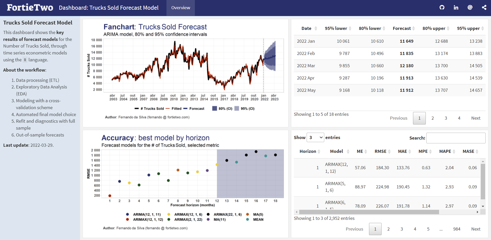

<!-- README.md is generated from README.Rmd. Please edit that file -->

# trucks

<!-- badges: start -->

<!-- badges: end -->

Code for replicating econometric forecast models of time series for the
variable referring to the **total of trucks sold**, using macroeconomic
factors.

-   `code`: folder with R codes for replication (file `run_workflow.R`
    automates the routines);
-   `data`: folder with input and output data;
-   `docs`: general and documentation files (work in progress).

You can check a summary of the main results through the dashboard:
<https://fortietwo.com/trucks/>

### Report bugs

If you find any errors or have suggestions, feel free to create a [new
issue](https://github.com/schoulten/trucks/issues) or contact me:
<fernando@fortietwo.com>

## Next steps

These are some of the future steps to improve prediction/code models:

-   Explore more non-stationary time series models
-   Explore VAR in differences
-   Explore models with Bayesian estimation
-   Explore models with time-varying parameters (TVP)
-   Improve logic for selecting VECM models
-   Improve/implement final model choice logic and out-of-sample
    prediction
-   Reduce number of dependencies used in the project
